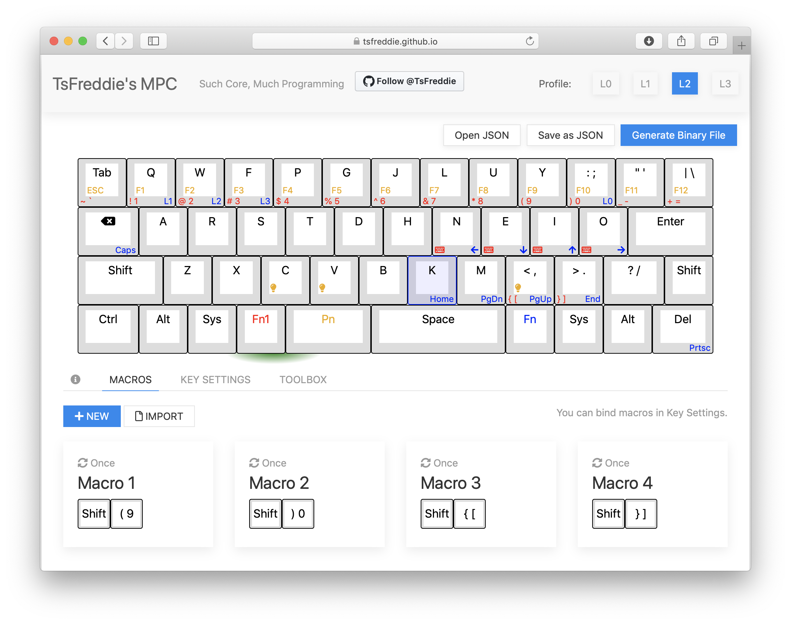
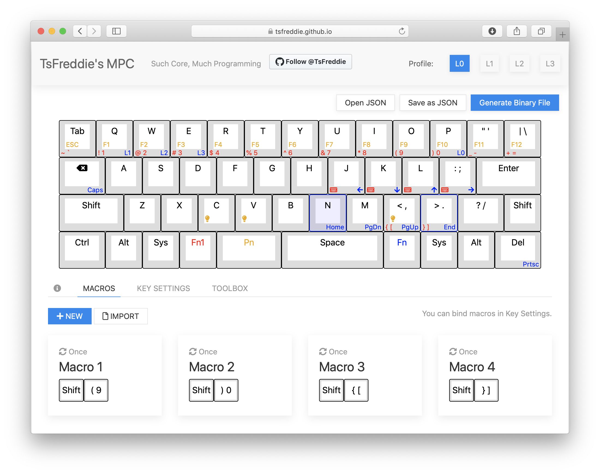

### Vorter Core Much Programming Core Configuration

Qwerty came first on layer 0 and 1 since my computers are already in Colemak. Layer 3 and 4 are in Colemak, prepared to be plugged into  other computer that's not mine. `(`, `)`, `{`, and `}` are mapped into macro to support my programming hours. The overall layout are designed to makes it similiar to conventional keyboard layout so I'll be in no trouble when switching back to Thinkpad keyboard. You can see that I raised up the number row to the same level as functions keys, put `|\` on top of `Enter` key, and other adjustments. Since I'm an avid Vim user, arrow keys are mapped into HJKL-like keys though they aren't in HJKL.

#### Screenshots

 

